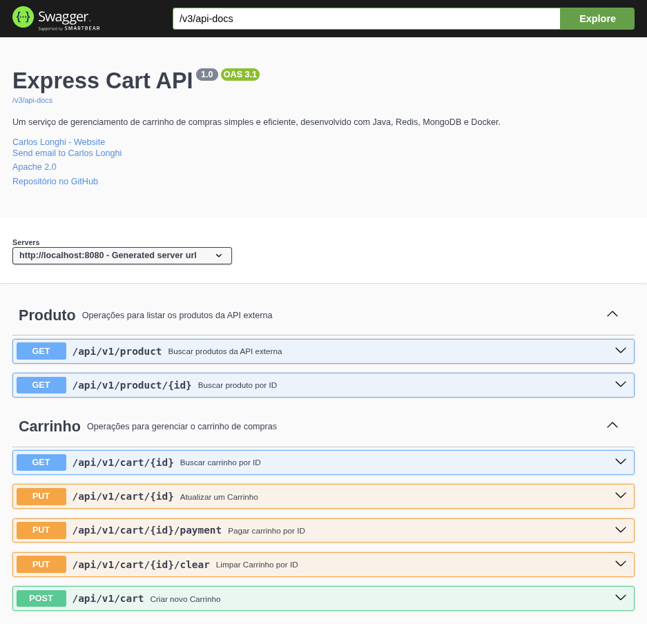
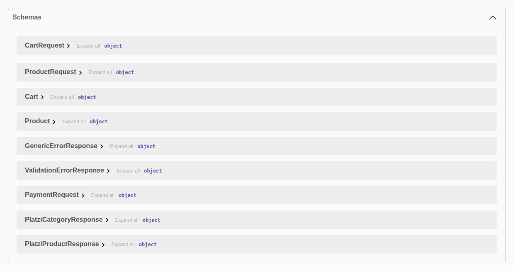

# 🛒 Express Cart

Um serviço simples e eficiente de gerenciamento de carrinho de compras, utilizando tecnologias modernas para oferecer **performance** e **escalabilidade**.

---

## 🔗 Índice
- [📖 Sobre o Projeto](#-sobre-o-projeto)
- [🛠 Tecnologias Utilizadas](#-tecnologias-utilizadas)
- [✨ Funcionalidades](#-funcionalidades)
- [📸 Screenshots Swagger](#-screenshots-swagger)
- [📐 Arquitetura](#-screenshots-swagger)
- [🚀 Como Rodar o Projeto](#-como-rodar-o-projeto)

---

## 📖 Sobre o Projeto

O **Express Cart** gerencia um carrinho de compras simples, integrando dados de uma **API externa** para fornecer produtos disponíveis.

O sistema combina **Cache (Redis)**, **Banco de dados NoSQL (MongoDB)** e **Contêineres (Docker)** para garantir **ALTA PERFORMANCE** e **ESCALABILIDADE**.

### 🎯 Principais Objetivos
- Oferecer uma experiência fluida ao usuário.
- Minimizar chamadas desnecessárias à API externa através do **cache**.
- Facilitar o deploy em ambientes **containerizados**.

---

## 🛠 Tecnologias Utilizadas

- **Java 17**  
  Linguagem moderna e performática.  
  👉 [Documentação oficial](https://docs.oracle.com/en/java/)

- **Lombok**  
  Elimina boilerplate, gerando getters, setters e construtores.  
  👉 [Documentação oficial](https://projectlombok.org/)

- **Redis**  
  Banco em memória usado como **cache** para otimizar requisições.  
  👉 [Introdução ao Redis](https://redis.io/docs/)

- **MongoDB**  
  Banco de dados **NoSQL** para persistência flexível dos dados.  
  👉 [Documentação oficial](https://www.mongodb.com/docs/)

- **OpenFeign**  
  Cliente HTTP declarativo que simplifica chamadas a APIs externas.  
  👉 [Documentação oficial](https://spring.io/projects/spring-cloud-openfeign)

- **Docker**  
  Containerização para deploy simples e consistente.  
  👉 [Documentação oficial](https://docs.docker.com/)

- **API Externa**  
  Fonte de dados de produtos integrados ao carrinho.

---

## ✨ Funcionalidades
- **Listar Produtos** – Busca produtos disponíveis na API externa.
- **Criar, Alterar, Pagar e Limpar** – Controle total do carrinho.
- **Cache Inteligente (Redis)** – Reduz tempo de resposta.
- **Persistência com MongoDB** – Armazena o carrinho de forma segura.
- **Integração com API Externa** – Produtos atualizados em tempo real.
- **Suporte a Docker** – Facilita a execução em qualquer ambiente.

---

## 📸 Screenshots Swagger
- **Endpoints da API**
 

- **Schemas** *(Entidades e DTO's)*
  

---

## 📐 Arquitetura do Projeto
```tree
src/
 ├── main/
 │   ├── java/
 │   │   └── br/com/expresscart/
 │   │       ├── client/
 │   │       │   ├── response/
 │   │       │   │   ├── PlatziCategoryResponse
 │   │       │   │   └── PlatziProductResponse
 │   │       │   └── PlatziStoreClient
 │   │       │
 │   │       ├── config/
 │   │       │   ├── ControllerAdvice
 │   │       │   └── CustomErrorDecoder
 │   │       │
 │   │       ├── controller/
 │   │       │   ├── api/docs/
 │   │       │   │   ├── CartApi
 │   │       │   │   └── ProductApi
 │   │       │   ├── request/
 │   │       │   │   ├── CartRequest
 │   │       │   │   ├── PaymentRequest
 │   │       │   │   └── ProductRequest
 │   │       │   ├── CartController
 │   │       │   └── ProductController
 │   │       │
 │   │       ├── entity/
 │   │       │   ├── Cart
 │   │       │   ├── PaymentMethod
 │   │       │   ├── Product
 │   │       │   └── Status
 │   │       │
 │   │       ├── exception/
 │   │       │   ├── handler/
 │   │       │   │   ├── BusinessException
 │   │       │   │   └── DataNotFoundException
 │   │       │   └── response/
 │   │       │       ├── GenericErrorResponse
 │   │       │       └── ValidationErrorResponse
 │   │       │
 │   │       ├── repository/
 │   │       │   └── CartRepository
 │   │       │
 │   │       ├── service/
 │   │       │   ├── CartService
 │   │       │   ├── ProductService
 │   │       │   └── ExpressCartApplication
 │   │
 │   └── resources/
 │       ├── application.yml
 │       └── (outros arquivos de configuração, mapeamentos, etc.)
 │
 └── test/
     └── java/
         └── br/com/expresscart/
             └── (testes unitários e de integração)
```

---

## 🚀 Como Rodar o Projeto

### 🔧 Pré-requisitos
- [Docker](https://docs.docker.com/) (ou instâncias locais de Redis e MongoDB)
- [Java 17+](https://docs.oracle.com/en/java/)
- [Maven](https://maven.apache.org/) (ou utilize `mvnw`)

### ▶️ Rodando a aplicação

```bash
# Clone este repositório
git clone https://github.com/CarlosLonghi/API-ExpressCart

# Acesse a pasta do projeto
cd API-ExpressCart

# Suba os serviços do Docker
docker-compose up -d

# Compile e rode a aplicação
./mvnw spring-boot:run
```
